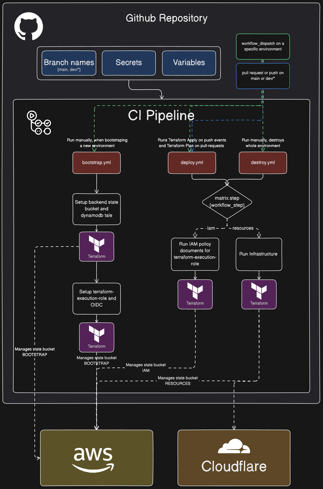

## Pipeline Overview

### Repository setup
1. If using `ad-m/github-push-action@master` in a workflow. Enable `Allow GitHub Actions to create and approve pull requests` in Github Actions -> General
2. Add `AWS_REGION` and `ORGANIZATION` to repository variables

### Set up and create infra on a new environment
1. Create a new AWS account
2. Create a new IAM bootstrap user and add [this](bootstrap/README.md) as inline policy
3. Set up a new repository environment in Github
4. Create secret access key from the bootstrap user and add `BOOTSTRAP_AWS_ACCESS_KEY` and `BOOTSTRAP_AWS_ACCESS_SECRET` as secrets for the environment
5. Go to Actions and run the Bootstrap workflow
6. Trigger workflow_dispatch on "Deploy Infrastructure". If environment does not exist in dropdown you need to add it [here](https://github.com/carlssonk/terraform-aws-infra/blob/main/.github/workflows/deploy.yml#L10)
7. Done.

### Destroy infra for an environment
1. Run Destroy Infrastructure workflow manually in Github Actions
2. (Optional: Remove bootstrap setup) Delete the `s3` terraform state bucket (and the contents inside it) and the `dynamodb table` + IAM resources: `terraform-execution-role`, `terraform-base-policy` and `Identity Provider`
3. Done

### Set up Cloudflare
1. Create a Cloudflare account
2. Add your domain name and make sure DNS records are empty and you have added the cloudflare nameservers to your domain register
3. Retrieve your API token at your [Cloudflare dashboard](https://dash.cloudflare.com/profile/api-tokens) and add `CLOUDFLARE_API_TOKEN` to your environment secret.
4. Done

### Project Structure
| Path                                  | Description                                                                                                                                                                                        |
|---------------------------------------|----------------------------------------------------------------------------------------------------------------------------------------------------------------------------------------------------|
| .github/workflows/bootstrap.yml       | Sets up initial infrastructure (tf backend, oidc, terraform-execution role, etc.) for a new environment                                                                                            |
| .github/workflows/deploy.yml          | Deploys infrastructure in 2 steps; iam -> resources. Trunk-based development is used + separation for dev environment.                                                                             |
| .github/workflows/destroy.yml         | Destroys infrastructure in 2 steps; resources -> iam. Can only be dispatched throught GHA.                                                                                                         |
| .github/workflows/destroy.yml         | Destroys infrastructure in 2 steps; resources -> iam. Can only be dispatched throught GHA.                                                                                                         |
| .github/workflows/remove_tf_state.yml | Remove a specific resource from state bucket for situations when there's a mismatch between terraform state and real life state                                                                    |
| .vscode/settings.json                 | Project settings                                                                                                                                                                                   |
| apps/                                 | Directory where all apps and services are defined                                                                                                                                                  |
| apps/app_name/iam_deploy.tf           | Create role with necessary IAM permissions for deploying the app                                                                                                                                   |
| apps/app_name/main.tf                 | App infrastructure defined here                                                                                                                                                                    |
| apps/app_name/outputs.tf              | Every app which has aws resources needs to output a policy_document to the root (main.tf) file                                                                                                     |
| apps/app_name/variables.tf            | Variables from the common module                                                                                                                                                                   |
| bootstrap/setup-backend/              | Bootstraps backend state (s3 + dynamodb)                                                                                                                                                           |
| bootstrap/setup-oidc/                 | Sets up terraform-execution-role and OIDC so deploy and destroy can be executed                                                                                                                    |
| common/                               | Common infrastructure                                                                                                                                                                              |
| environments/                         | Configuration for different environments. Terraform execution are in these folders                                                                                                                 |
| environments/dev/                     | Config for dev environment. Apply will be ran on pushes to branch names starting with dev/*                                                                                                        |
| environments/staging-and-prod/        | Config for staging and prod. We keep them in same directory because staging should essentially be a copy of prod with some different configurations defined in prod.tfvars and staging.tfvars      |
| globals/                              | Global module that can be imported in other modules. Prevents "prop drilling". This module reads from globals.json that gets generated in CI workflow                                              |
| iam_policy/                           | Combines multiple policy documents into one policy                                                                                                                                                 |
| modules/                              | Cloud resources                                                                                                                                                                                    |
| scripts/ci_create_globals.py             | Used in CI workflows to generate globals.json                                                                                                                                                      |
| scripts/ci_retry_command.sh              | Used in CI workflows to retry terraform commands                                                                                                                                                   |
| scripts/ci_set_modules.sh                | Used in CI workflows to prepare modules. If workflow_type is 'iam' every file in each module will be removed except for iam.tf. If workflow_type is resources only the iam.tf file will be removed |

### Security Measures Checklist
If using NAT Gateway
- [ ] ~~Should place resources in private subnets when possible~~
- [ ] ~~Should have Load Balancer in private subnet if using a CDN on top of it, else it should be public~~
- [ ] ~~Should have ECS services in private subnet if using a Load Balancer on top of ir, else it should be public~~

If NOT using NAT Gateway
- [ ] Should place resource in privat subnets when possible while keeping it robust and scalable
- [ ] Should have Load Balancer in a public subnet (its technically possible to have it in private subnet but its too much management overhead and isn't robust)
- [ ] Should have ECS services in private subnets if using Load Balancer on top of it AND it doesnt need to make outbound requests (API calls, Websockets etc.)

### Potential Cost Optimizations
* Use fck-nat in replacement for NAT Geteway
* Private IPv4 addresses associated with a running instance are free. But public IPv4 addresses it costs $0.005 per hour per associated service
* IPv6 addresses are free
* fck-nat or VPC Endpoints (if applicable) might be cheaper than having lots of services in public subnets
* NAT Gateway is not needed when using IPv6. aws_egress_only_internet_gateway is free and handles IPv6 traffic only, should be used for private services

Example Architecture Overview with NAT Gateway
IPv4 addresses
Cloudflare -> Load Balancer (public subnets) -> Services (private subnets) -> NAT Gateway (public subnets) -> Internet
IPv6 addresses
Cloudflare -> Load Balancer (public subnets) -> Services (no need for public/private distinciton) -> Egress-only Internet Gateway -> Internet

Debug ec2 instance: 
cat /var/log/cloud-init-output.log
cat /var/log/cloud-init.log
